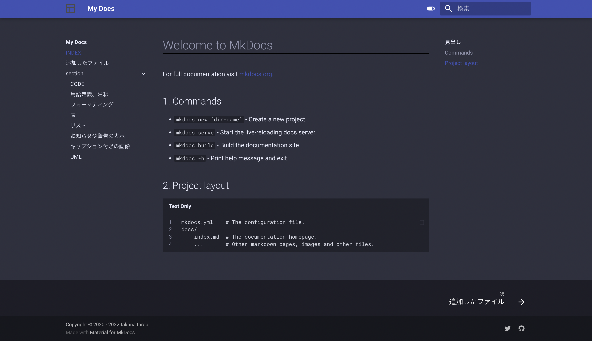
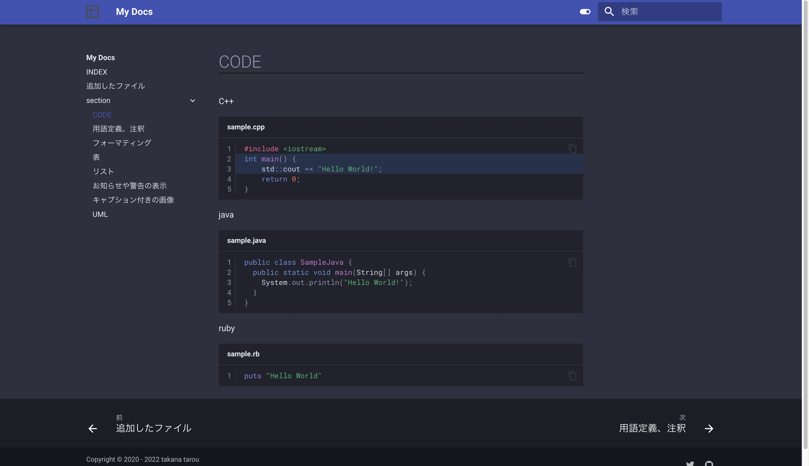
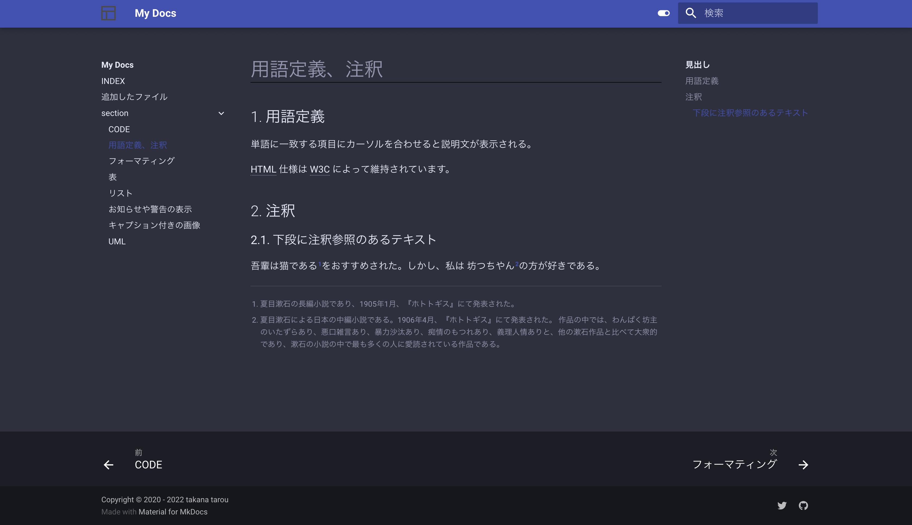
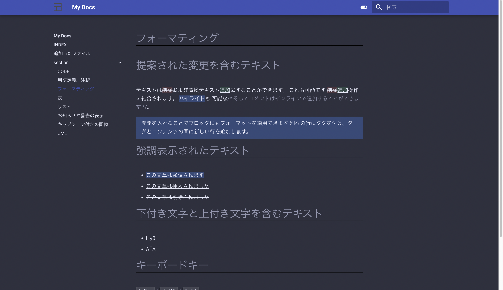
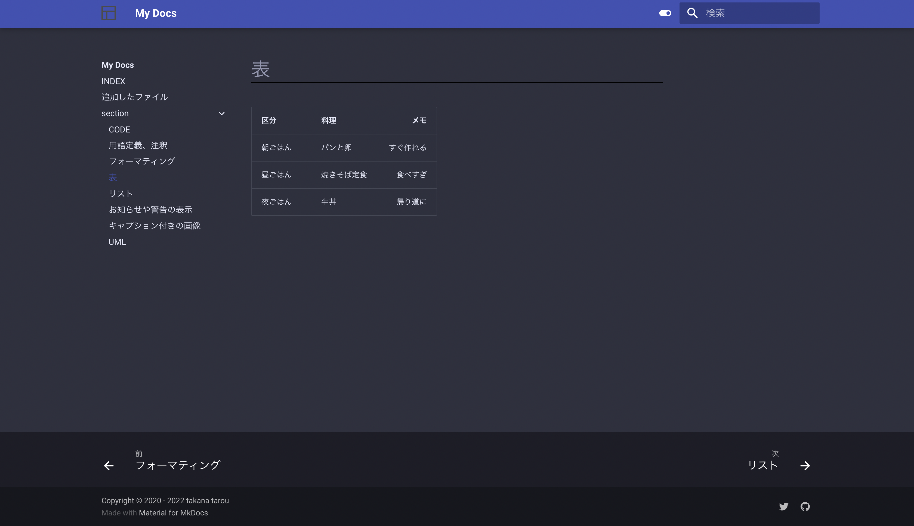
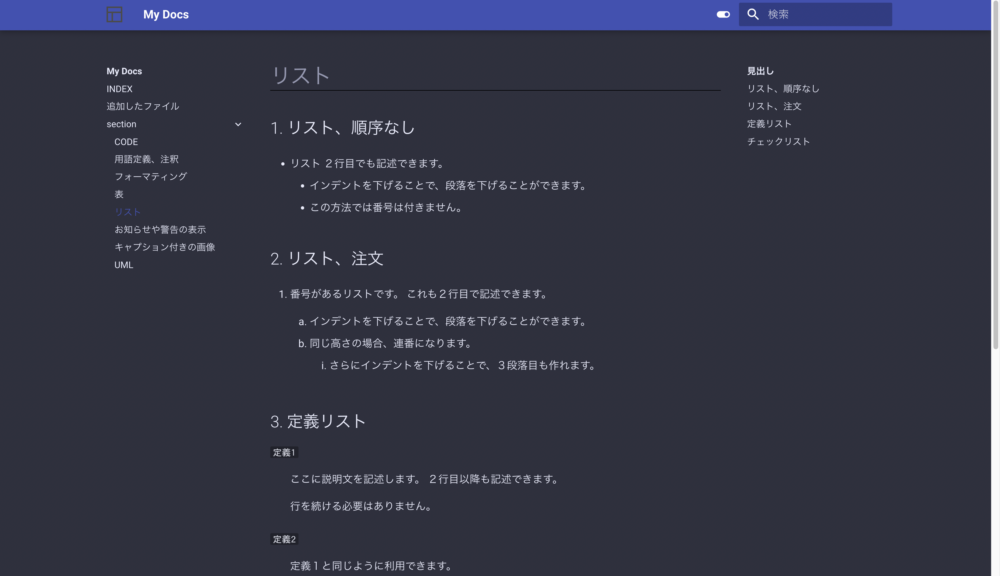
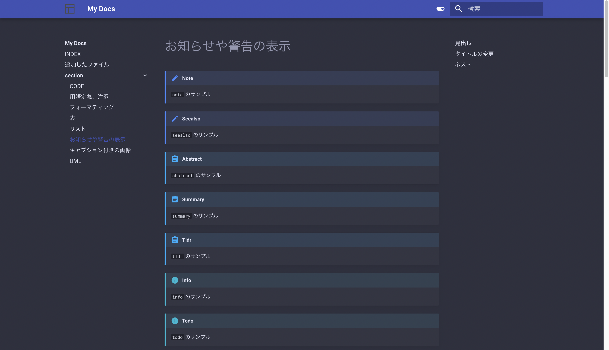
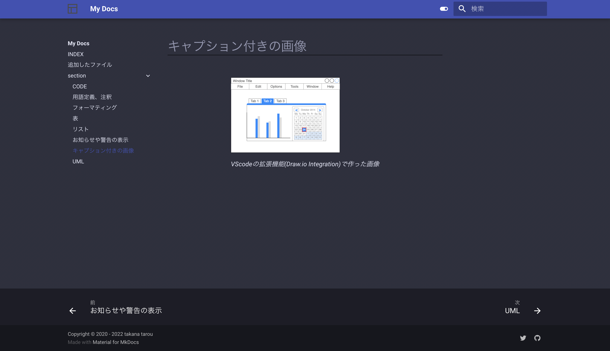
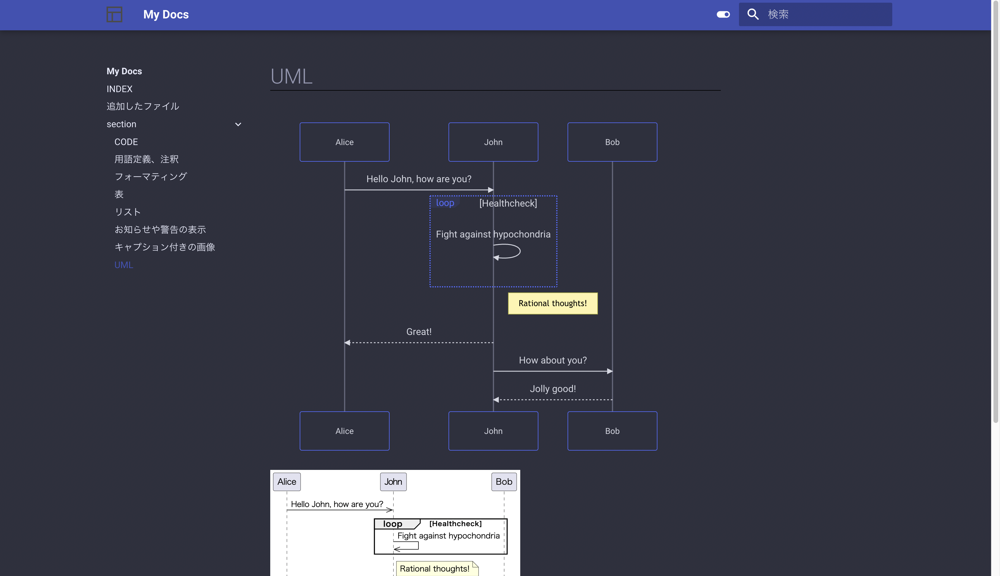

## はじめに

このリポジトリは、mkdocsを用いてソフトウェアドキュメント製作に適している環境の構築を目指したものです。
mkdocsにはplantumlやmermaidを入れたり、用語定義やタブなど多くの鮮やかな表示機能を有効にしています。

## 利用の仕方(build)

次の手順でHTMLファイルを生成します。

ご自身のホストディレクトリの`mkdocs-sample/docs/site/index.html`を開いてください。

```
~ % git clone https://github.com/ryohei-takasugi/mkdocs-sample.git
~ % cd mkdocs-sample
mkdocs-sample % docker-compose up -d
mkdocs-sample % sh shell/build.sh
mkdocs-sample % open docs/site/index.html
```

## 利用の仕方(serve)

次の手順でserverを起動します。

```
~ % git clone https://github.com/ryohei-takasugi/mkdocs-sample.git
~ % cd mkdocs-sample
mkdocs-sample % sh shell/up.sh
mkdocs-sample % sh shell/serve_start.sh
mkdocs-sample % open http://localhost:18000 
```

停止する際は、Ctrl+Cで停止して、次のコマンドを実行します。

```
mkdocs-sample % sh shell/serve_stop.sh
```


## 新しくドキュメントを作成する

このリポジトリでは、サンプルデータが入った状態です。

新しくご自身で利用するときは、次の操作を行います。

```
mkdocs-sample % rm -rf docs/docs/* 
mkdocs-sample % rm -rf docs/includes/* 
mkdocs-sample % rm -rf docs/site
mkdocs-sample % sh shell/new.sh
```

もしくは次のファイルを、ご自身のプロジェクトフォルダに配置してください。

```
shell/build.sh
shell/new.sh
shell/serve.sh
docs/mkdocs.yml
docker-compose.yml
Dockerfile
```

## すべてのDocker環境を停止し、削除する

作業が終了したら、Dockerコンテナおよびイメージを削除します。
削除は次のコマンドで実行します。

```
mkdocs-sample % sh shell/dwon_all.sh
```

## 画面キャプチャ

* 画面1


* 画面2


* 画面3


* 画面4


* 画面5


* 画面6


* 画面7


* 画面8


* 画面9

